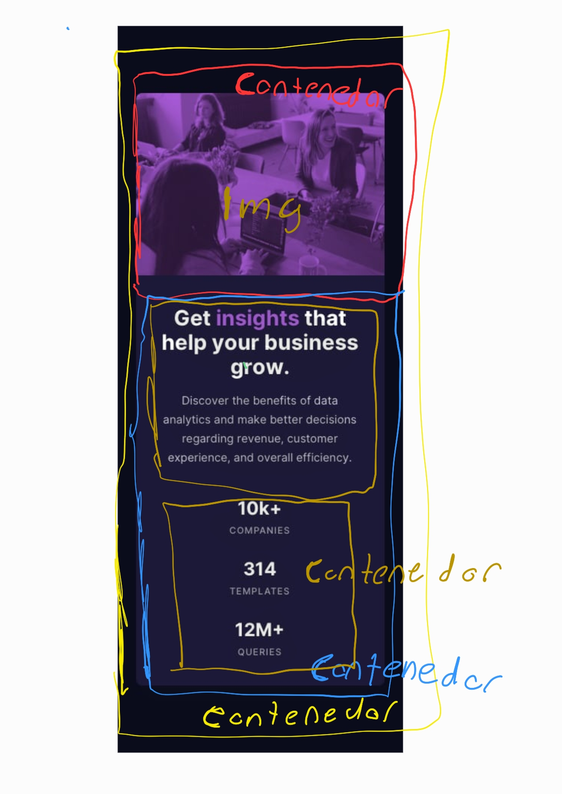

# Card stats

* [Descripción](#descripcion)
* [Proceso y Desarrollo](#proceso-y-desarrollo)
    1. [Built With](#built-with)
    2. [Criterios del Desarrollo](#criterios-del-desarrollo)
    3. [Construccion de la pagina](#construccion-de-la-pagina)
    4. [Guide style CSS](#guide-style-css)
* [Result](#result)
* [What I Learn](#what-i-learn)
* [Where I Learn](#where-i-learn)

## Descripción
Este es un desafío de [Frontend Mentor](https://www.frontendmentor.io/challenges/stats-preview-card-component-8JqbgoU62), de aquí se obtienen tanto el diseño, contenido, tipografía y colores, para que se pueda realizar su construcción sin dificultades en cuanto a la fidelidad.

Dicho lo anterior **yo me encargué de desarrollar y construir la página**, los criterios para este desafío son: 
1. La página debe verse lo más parecido al diseño que es proveído para **desktop (1440px de ancho)**.
2. La página debe verse lo más parecido al diseño que es proveído para **mobilel/smartphone (375px de ancho)**.

**Diseño para Mobile.**

**Diseño para Desktop.**

## Proceso y Desarrollo 

### Built With
	
En este trabajo se utilizan tecnologías **HTML** & **CSS**, en su estado puro sin uso de herramientas extras, ambas son las únicas capaces para trabajar en el navegador, HTML para la estructura del Documento y CSS para la presentación.

Se utilizó la **Metodología Block Element Modifier (BEM)**, esta es aplicada para el manejo de clases, mismas que se utilizan para la aplicación del CSS.

Se utilizó como controlador de versiones **Git** para el desarrollo local y **GitHub** para guardar el proyecto en un repositorio remoto.

Se implementó la filosofía de **Mobile First**, en esta se piensa construyendo primero la versión o el diseño que es se necesita para los dispositivos mobile, después con eso se tiene una base que para los otros tipos de viewport y de allí se empieza a modificar.

### Criterios del Desarrollo

Para mi documento HTML debe partir de analizar los múltiples diseños que se tengan, observar que elementos se mantienen hasta cierto punto relacionados.  
1. Aquellos que se mantengan agrupados nos dará una sobre los elementos o bloques **"padre o madre"**
2. Dentro de cada Bloque madre encontrado tenemos que ver la composición en cada diseño, esto nos ayuda a diferenciar a los hijos.  
3. Observar las constancias y relaciones para crear las clases.
4. Repite los pasos anteriores hasta encontrar una estructura ideal.

Para que sea HTML semántico ahora toca preguntarte lo siguiente:

1. ¿Qué hace cada elemento?
2. ¿Cuál es su propósito?
3. ¿Cuál es su comportamiento en el diseño?

Luego elige la etiqueta HTML que cumpla con dichas preguntas y si existen dudas se puede ir siempre a la documentación o búsqueda en la web. 

### Construccion de la pagina

Si aplicas lo se describe en la sección anterior tenemos el siguiente flujo:

1. Un contenedor principal o la **card**.
2. Esta **card** tiene dos **Hijos**.
3. Uno de estos hijos es **Contenedor**, el cual tiene como hijo una **Imagen** 
4. El otro hijo de la **card** es un **contenedor** que dentro de él, tiene la información.
5. Dentro de este contenedor de información, se tienen **3 hijos**.
6. El primero es el **Título**.
7. El segundo es **texto**.
8. Por último son las **Estadísticas**
9. Las estadísticas se ven **3 estadísticas diferentes**.
10. Entonces se tiene un **Hijo por cada estadística**.

Nos queda de base la siguiente estructura:

[**Para ver más a detalle el código HTML**](https://github.com/JoseLuisFV/challenge-card-component/blob/master/index.html)

### Guide Style CSS

Para el CSS explicar cada decisión paso por paso sería muy largo, por lo que solamente lo mejor será explicar el orden en que los estilos se acomodan, se trató de seguir el siguiente orden dentro de cada **selector**:

1. Primero se agregan los estilos del posicionamiento (abosolute, top, static, etc.).
2. Segundo lugar los estilos que son del display (block, flex-direction, grid-row, etc.).
3. Tercero los estilos que tiene relación con el modelo de caja (width, padding, margin, etc.)
4. Cuarto lugar los estilos de los textos (font-size, line-height, align-text, etc).
5. Por último los que decoran(background, box-shadow, border-radius, etc).
6. Si hay transiciones o animación se agregan al final.

## Result

In [**this link**](https://joseluisfv-card-component.netlify.app) you can see the resul of this project.

## What I Learn

Este desafío es para probar mis habilidades, como primera página o trabajo hecho sin ayuda o guía directa, puedo decir que descubrí realmente las ventajas que la metodología o filosofía mobile first, porque al terminar esa versión ya se tiene una base de diseño, sobre la  que se va modificando y construyendo.

Por ejemplo en las **Estadísticas** en la versión mobile se le colocó un display flex, con **flex-direction: column**, y para el desktop solo se le cambió su valor a **row**, también hay 3 propiedades de css que soportan muy bien esta metodología las cuales son **min-width, width y max-width**, con estas se controla perfectamente el tamaño de anchura.

También se aprendió que las imágenes se les tiene que agregar un **Display block**, porque por defecto vienen en **inline-block**, lo que hace que se quede un espació extra, que imposibilita que tome el tamaño sé su contenedor.

## Where I Learn

Lo aplicado en este desafío lo aprendí en una plataforma online llamada [**platzi**](https://platzi.com/)

## Author

- Website - [JoseLuisFV](https://joseluisfv.github.io/)
- Frontend Mentor - [@JoseLuisFV](https://www.frontendmentor.io/profile/JoseLuisFV)
- Twitter - [@FloresVacio](https://www.twitter.com/FloresVacio)

